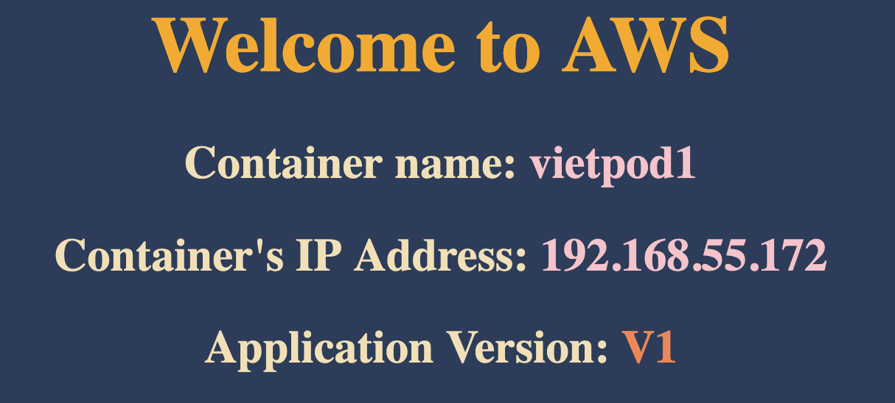

# 0️⃣ Expose Pod as a service

**✅ Benefit**: By default, pod is private. You want the pod to be public, you
have to expose Pod as a **Node Port** Service or **LoadBalancing** Service.

Command:

```
kubectl expose pod <pod_name> --type=NodePort --port=<pod_port> --target-port=<container_port> --name=<service_name>
```

Example:

```
kubectl expose pods vietpod1 --type=NodePort --port=8081 --target-port=8080 --name=service1
```

## ‼️ Notes:

- Container is running at port 8080
- Pod will run at port 8081. Normally, we will configure `port` and
  `target-port` in same port. But I want to make it clear to easy understanding.
- User will not access via `port 8081`. Each `NodePort` service will have a
  separated public port with the range: `32000-32767`
- When we use imperative way, we cannot specific NodePort, k8s will pick a
  random port. In declarative way, we can specific port in yaml file.
- if pod's port and container's port are same port. You don't need to specify
  `--target-port` attribute

Example:

```
kubectl expose pods vietpod1 --type=NodePort --port=8080 --name=service1
```

# 1️⃣ Verify

## 🍄 Get all services

```

kubectl get svc

```

Output example:

```

NAME TYPE CLUSTER-IP EXTERNAL-IP PORT(S) AGE kubernetes ClusterIP 10.100.0.1
<none> 443/TCP 3d10h service1 NodePort 10.100.235.249 <none> 8081:30238/TCP 3s

```

✅ You can see our service is running at port: **30238**

✅ This port will be randomized.

## 🍄 View Service detail

```
kubectl describe svc <service_name>
```

Example:

```
kubectl describe svc service1`
```

Ouput:

```
Name:                     service1
Namespace:                default
Labels:                   run=vietpod1
Annotations:              <none>
Selector:                 run=vietpod1
Type:                     NodePort
IP Family Policy:         SingleStack
IP Families:              IPv4
IP:                       10.100.235.249
IPs:                      10.100.235.249
Port:                     <unset>  8081/TCP
TargetPort:               8080/TCP
NodePort:                 <unset>  30238/TCP
Endpoints:                192.168.55.172:8080
Session Affinity:         None
External Traffic Policy:  Cluster
Events:                   <none>
```

## 🍄 Finding Public IP of Worker node

```

kubectl get nodes -owide

```

Output example:

```

NAME STATUS ROLES AGE VERSION INTERNAL-IP EXTERNAL-IP OS-IMAGE KERNEL-VERSION
CONTAINER-RUNTIME ip-192-168-12-246.ap-southeast-1.compute.internal Ready <none>
3d9h v1.29.0-eks-5e0fdde 192.168.12.246 52.221.232.0 Amazon Linux 2
5.10.213-201.855.amzn2.x86_64 containerd://1.7.11
ip-192-168-35-199.ap-southeast-1.compute.internal Ready <none> 3d9h
v1.29.0-eks-5e0fdde 192.168.35.199 47.129.54.45 Amazon Linux 2
5.10.213-201.855.amzn2.x86_64 containerd://1.7.11

```

You can see there are 02 nodes with public ip:

- Node 1: `52.221.232.0`
- Node 2: `47.129.54.45`

# 2️⃣ Access NodePort Service

```

http://<public-node-ip>:<nodeport-port>/

```

Example:

```

http://47.129.54.45:30238

```

Try to access same port but in remaining node: http://52.221.232.0:30238

Website:


```

# 3️⃣ Delete Pod & NodePort Service

```
# delete pod
kubectl delete pod vietpod1

# delete service
kubectl delete svc service1

# verify running pod
kubectl get pods

# verify services
kubectl get svc
```

✅ Congratulations! 🚀🚀🚀
