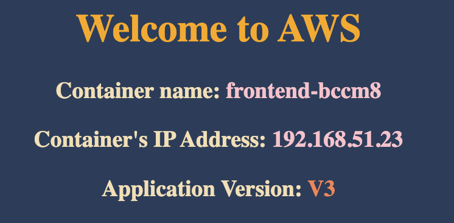

# ✅ Benefit:

- Maintain and running set of pods.
- If the pod is down, k8s can provision another pod. Maintain HA and resilency
  for application.
- Can `scale` replicaset up/down
- Group pod by using `labels`
- If you set `replicas=3`, and you have an existing pod with `matched label`.
  k8s only create two another pods.

# 1️⃣ Create replicaset's manifest

### 📗 Detail: https://kubernetes.io/docs/concepts/workloads/controllers/replicaset/

## ⭐️ Replicaset's manifest:

```
apiVersion: apps/v1
kind: ReplicaSet
metadata:
  name: frontend
  labels:
    app: user-mgnt
    tier: frontend
    env: dev
spec:
  # modify replicas according to your case
  replicas: 3
  selector:
    matchLabels:
      tier: frontend
  template:
    metadata:
      labels:
        tier: frontend
    spec:
      containers:
      - name: vietaws
        image: vietaws/eks:v3
```

Save the manifest to file: `rs-demo.yaml`

## ⭐️ Run the manifest

```
kubectl create -f rs-demo.yaml
```

➡️ Output: `replicaset.apps/frontend created`

# 2️⃣ Verify ReplicaSet

## ✅ Check replicaset status

```
kubectl get rs
```

Output:

```
NAME       DESIRED   CURRENT   READY   AGE
frontend   3         3         3       39s
```

➡️ There are 3 pods **READY**

## ✅ Check all pods

```
kubectl get pods
```

Output:

```
NAME             READY   STATUS    RESTARTS   AGE
frontend-56ctg   1/1     Running   0          112s
frontend-92chj   1/1     Running   0          112s
frontend-bccm8   1/1     Running   0          112s
```

## ✅ Check ReplicaSet detail

Syntax

```
kubectl describe rs <replicaset_name>
```

Example:

```
kubectl describe rs frontend
```

Output example:

```
Name:         frontend
Namespace:    default
Selector:     tier=frontend
Labels:       app=user-mgnt
              env=dev
              tier=frontend
Annotations:  <none>
Replicas:     3 current / 3 desired
Pods Status:  3 Running / 0 Waiting / 0 Succeeded / 0 Failed
Pod Template:
  Labels:  tier=frontend
  Containers:
   vietaws:
    Image:        vietaws/eks:v3
    Port:         <none>
    Host Port:    <none>
    Environment:  <none>
    Mounts:       <none>
  Volumes:        <none>
Events:
  Type    Reason            Age    From                   Message
  ----    ------            ----   ----                   -------
  Normal  SuccessfulCreate  7m56s  replicaset-controller  Created pod: frontend-92chj
  Normal  SuccessfulCreate  7m56s  replicaset-controller  Created pod: frontend-56ctg
  Normal  SuccessfulCreate  7m56s  replicaset-controller  Created pod: frontend-bccm8
```

## ✅ Check Pod detail

```

kubectl describe pods frontend-56ctg

```

`frontend-56ctg` is Pod name

# 3️⃣ Expose ReplicaSet to NodePort

Syntax

```
kubectl expose rs <replicaset_name> --type=NodePort --port=<container_port> --name=<service_name>
```

Example:

```
kubectl expose rs frontend --type=NodePort --port=8080  --name=service3
```

➡️ Output: `service/service3 exposed`

## ✅ Get service port

```
kubectl get svc
```

Output example:

```
NAME         TYPE        CLUSTER-IP       EXTERNAL-IP   PORT(S)          AGE
kubernetes   ClusterIP   10.100.0.1       <none>        443/TCP          3d12h
service3     NodePort    10.100.241.230   <none>        8080:32438/TCP   75s
```

**Running Port: 32438**

## ✅ Get Node's Public IP

```
kubectl get nodes -owide
```

Output example:

```
NAME                                                STATUS   ROLES    AGE     VERSION               INTERNAL-IP      EXTERNAL-IP    OS-IMAGE         KERNEL-VERSION                  CONTAINER-RUNTIME
ip-192-168-12-246.ap-southeast-1.compute.internal   Ready    <none>   3d11h   v1.29.0-eks-5e0fdde   192.168.12.246   52.221.232.0   Amazon Linux 2   5.10.213-201.855.amzn2.x86_64   containerd://1.7.11
ip-192-168-35-199.ap-southeast-1.compute.internal   Ready    <none>   3d11h   v1.29.0-eks-5e0fdde   192.168.35.199   47.129.54.45   Amazon Linux 2   5.10.213-201.855.amzn2.x86_64   containerd://1.7.11
```

## ✅ Access service

Website: http://47.129.54.45:32438



# 4️⃣ Advanced Actions

## ✅ Check ownerReferences

```
kubectl get pods <pod_name> -o yaml
```

Example:

```
kubectl get pods frontend-bccm8 -o yaml
```

## ✅ Delete a Pod belong to a ReplicaSet

### 👍 Delete Pod

```
kubectl delete pods <pod_name>
```

Example:

```
kubectl delete pods frontend-bccm8
```

➡️ Output: `pod "frontend-bccm8" deleted`

### 👍 Checking new Pod

```
kubectl get pods
```

Output:

```
NAME             READY   STATUS    RESTARTS   AGE
frontend-56ctg   1/1     Running   0          27m
frontend-92chj   1/1     Running   0          27m
frontend-fpz5z   1/1     Running   0          83s
```

➡️ Pod `frontend-fpz5z` is newly created with duration of `83s`

# 5️⃣ Scaling ReplicaSet

## ⭐️ Update manifest YAML file - Declarative way

### Edit `rs-demo.yaml` file you created before.

```
# Before change
spec:
  replicas: 3

# After change
spec:
  replicas: 6
```

### Run

```
# Apply latest changes to ReplicaSet
kubectl replace -f rs-demo.yaml

# Verify if new pods got created
kubectl get pods -owide
```

## ⭐️ Update using command line - Imperative way

### Syntax:

```
kubectl scale rs <replica_name> --replicas=<num_replicas>
```

### Example:

```
kubectl scale rs frontend --replicas=6
```

### Verify:

```
# get all replicaset
kubectl get rs

# get all pods
kubectl get nodes
```

#### Output:

✅ ReplicaSet

```
NAME       DESIRED   CURRENT   READY   AGE
frontend   6         6         6       36m
```

✅ Pods

```
NAME             READY   STATUS    RESTARTS   AGE
frontend-56ctg   1/1     Running   0          35m
frontend-5cc77   1/1     Running   0          3s
frontend-8sq4g   1/1     Running   0          3s
frontend-92chj   1/1     Running   0          35m
frontend-cwbvp   1/1     Running   0          3s
frontend-fpz5z   1/1     Running   0          9m10s

```

# 6️⃣ Cleanup

```
# delete replicaset
kubectl delete rs frontend

# delete service
kubectl delete svc service3

# check service
kubectl get svc

# check replicaset
kubectl get rs

# check pods
kubectl get pods
```

Output:

```
replicaset.apps "frontend" deleted
service "service3" deleted
NAME         TYPE        CLUSTER-IP   EXTERNAL-IP   PORT(S)   AGE
kubernetes   ClusterIP   10.100.0.1   <none>        443/TCP   3d12h
No resources found in default namespace.
No resources found in default namespace.
```
