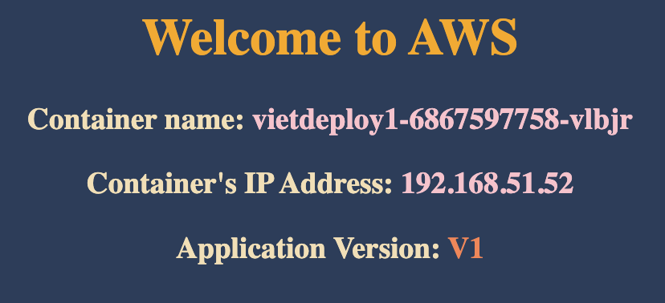
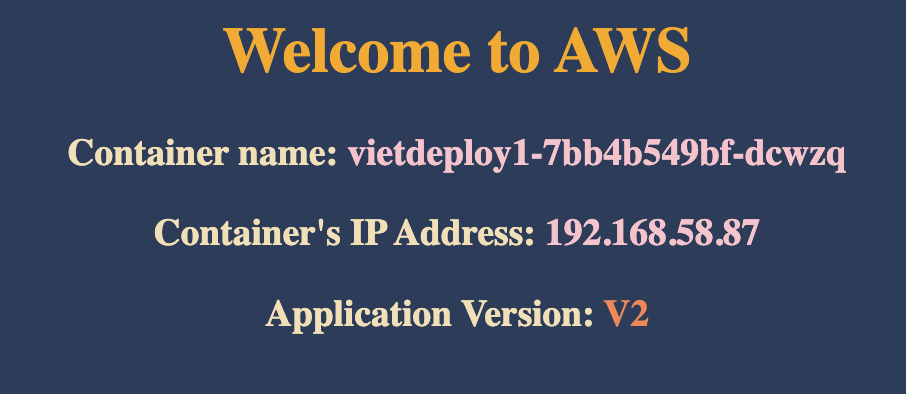
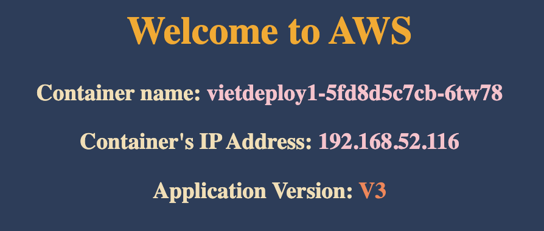
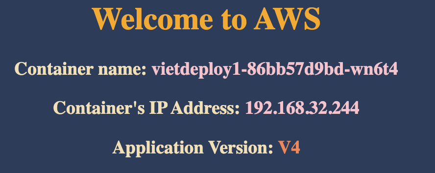

# 📗 Topics

1. Create Deployment
2. Scale Deployment
3. Expose Deployment as Service
4. Update Deployment
5. Rollback Deployment
6. Rolling Restarts
7. Pause & Resume Deployments
8. Canary Deployments

### 💡 Keynotes:

- Create a **Deployment** will roll-out a **ReplicaSet** automatically

# 1️⃣ Create Deployment

```
# Create Deployment
kubectl create deployment <deployment-name> --image=<container-image>
kubectl create deployment vietdeploy1 --image=vietaws/eks:v1
# Output: deployment.apps/vietdeploy1 created

# Verify Deployment
kubectl get deployments
kubectl get deploy

# Describe Deployment
kubectl describe deployment <deployment-name>
kubectl describe deployment vietdeploy1

# Verify ReplicaSet
kubectl get rs

# Verify Pod
kubectl get pods
```

### Output

Deployment

```
NAME          READY   UP-TO-DATE   AVAILABLE   AGE
vietdeploy1   1/1     1            1           29s
```

ReplicaSet

```
NAME                     DESIRED   CURRENT   READY   AGE
vietdeploy1-6867597758   1         1         1       57s
```

Pods

```
NAME                           READY   STATUS    RESTARTS   AGE
vietdeploy1-6867597758-vlbjr   1/1     Running   0          89s
```

# 2️⃣ Scale Deployment

## Scale Out

### Commands

```
kubectl scale --replicas=4 deployment/<deployment-name>
kubectl scale --replicas=4 deployment/vietdeploy1
# Output: deployment.apps/vietdeploy1 scaled

# Verify Deployment
kubectl get deploy
kubectl get rs
kubectl get pods
```

### Output

```
# Deployment
NAME          READY   UP-TO-DATE   AVAILABLE   AGE
vietdeploy1   4/4     4            4           8m28s

# ReplicaSet
NAME                     DESIRED   CURRENT   READY   AGE
vietdeploy1-6867597758   4         4         4       8m59s

# Pod
NAME                           READY   STATUS    RESTARTS   AGE
vietdeploy1-6867597758-6zpfz   1/1     Running   0          52s
vietdeploy1-6867597758-895ng   1/1     Running   0          52s
vietdeploy1-6867597758-vlbjr   1/1     Running   0          9m14s
vietdeploy1-6867597758-zt4t9   1/1     Running   0          52s
```

## Scale In

### Commands

```
kubectl scale --replicas=2 deployment/vietdeploy1

# Verify

kubectl get deployments
kubectl get rs
kubectl get pods

```

### Output

```
# Deployment
NAME          READY   UP-TO-DATE   AVAILABLE   AGE
vietdeploy1   2/2     2            2           10m

# ReplicaSet
NAME                     DESIRED   CURRENT   READY   AGE
vietdeploy1-6867597758   2         2         2       10m

# Pods
NAME                           READY   STATUS    RESTARTS   AGE
vietdeploy1-6867597758-895ng   1/1     Running   0          2m43s
vietdeploy1-6867597758-vlbjr   1/1     Running   0          11m
```

# 3️⃣ Expose Deployment as a Service

```
# Expose Deployment as a Service
kubectl expose deployment <deployment-name> --type=NodePort --port=8080
--name=<service-name>

kubectl expose deployment vietdeploy1 --type=NodePort --port=8080 --name=service1
# Output: service/service1 exposed

# Get Service Info
kubectl get svc

# Get Public IP of Worker Nodes
kubectl get nodes -owide
```

Output

```
# kubectl get svc
NAME         TYPE        CLUSTER-IP      EXTERNAL-IP   PORT(S)          AGE
kubernetes   ClusterIP   10.100.0.1      <none>        443/TCP          3d18h
service1     NodePort    10.100.153.52   <none>        8080:31975/TCP   5s

# kubectl get pods
NAME                           READY   STATUS    RESTARTS   AGE
vietdeploy1-6867597758-895ng   1/1     Running   0          7m53s
vietdeploy1-6867597758-vlbjr   1/1     Running   0          16m

```

Website:



# 4️⃣ Update Deployment Using "set image"

```
# Get Container Name from current deployment
kubectl get deployment vietdeploy1 -o yaml

# Output Container Name: eks
# Output Container Image: vietaws/eks:v1

# Update Deployment to Version 2
kubectl set image deployment/<deployment-name> <container-name>=<container-image>
kubectl set image deployment/vietdeploy1 eks=vietaws/eks:v2

# Output: deployment.apps/vietdeploy1 image updated
```

### 🔑 Before

Deployment

```
# kubectl get deployments

NAME          READY   UP-TO-DATE   AVAILABLE   AGE
vietdeploy1   2/2     2            2           3h40m

# kubectl get rs

NAME                     DESIRED   CURRENT   READY   AGE
vietdeploy1-6867597758   2         2         2       27m

# kubectl get pods
NAME                           READY   STATUS    RESTARTS   AGE
vietdeploy1-6867597758-895ng   1/1     Running   0          3h32m
vietdeploy1-6867597758-vlbjr   1/1     Running   0          3h40m

```

### 💎 After

✅ ReplicaSet

```
# kubectl get rs

NAME                     DESIRED   CURRENT   READY   AGE
vietdeploy1-6867597758   0         0         0       3h43m
vietdeploy1-7bb4b549bf   2         2         2       115s

```

🌈 New Pods go from OLD ReplicaSet `vietdeploy1-6867597758` to NEW ReplicaSet
`vietdeploy1-7bb4b549bf`

✅ Pods

```

kubectl get pods

NAME                           READY   STATUS    RESTARTS   AGE
vietdeploy1-7bb4b549bf-dcwzq   1/1     Running   0          2m30s
vietdeploy1-7bb4b549bf-dlhr5   1/1     Running   0          2m29s

```

➡️ All Pods are re-deployed. By default, `Rolling deployment` is used and there
is no downtime.

➡️ You can access the NodePort Service but with total new Pods.



You will see version 2 of application.

### ⭐️ Deployment Rollout

```
# Check deployment status
kubectl rollout status deployment vietdeploy1
# Output: deployment "vietdeploy1" successfully rolled out

# Deployment Rollout History
kubectl rollout history deployments vietdeploy1

deployment.apps/vietdeploy1
REVISION  CHANGE-CAUSE
1         <none>
2         <none>
```

# 5️⃣ Update Deployment Using "Edit Deployment"

## Edit Deployment

```
# Watch Pod replacement
kubectl get pods -w

# Edit Deployment
kubectl edit deployment/<deployment-name>
kubectl edit deployment/vietdeploy1
```

## Update Spec

```
# Change From version 2
    spec:
      containers:
      - image: vietaws/eks:v2

# Change To version 3
    spec:
      containers:
      - image: vietaws/eks:v3
```

## Verify

```
# kubectl get deployments
NAME          READY   UP-TO-DATE   AVAILABLE   AGE
vietdeploy1   2/2     2            2           4h16m

# kubectl rollout status deployments vietdeploy1
deployment "vietdeploy1" successfully rolled out

# kubectl rollout history deployments vietdeploy1
deployment.apps/vietdeploy1
REVISION  CHANGE-CAUSE
1         <none>
2         <none>
3         <none>

# kubectl get rs
NAME                     DESIRED   CURRENT   READY   AGE
vietdeploy1-5fd8d5c7cb   2         2         2       2m52s
vietdeploy1-6867597758   0         0         0       4h18m
vietdeploy1-7bb4b549bf   0         0         0       36m

# kubectl get pods
NAME                           READY   STATUS    RESTARTS   AGE
vietdeploy1-5fd8d5c7cb-6tw78   1/1     Running   0          3m12s
vietdeploy1-5fd8d5c7cb-vvtnz   1/1     Running   0          3m11s
```

➡️ Same Deployment, New ReplicaSet, New Pods



✅ Application version 3 deployed

# 6️⃣ Rollback to Previous Version

## Check Revision

```
kubectl rollout history deployments vietdeploy1 --revision=1
kubectl rollout history deployments vietdeploy1 --revision=2
kubectl rollout history deployments vietdeploy1 --revision=3

# Example Output:

deployment.apps/vietdeploy1 with revision #1
Pod Template:
  Labels:	app=vietdeploy1
	pod-template-hash=6867597758
  Containers:
   eks:
    Image:	vietaws/eks:v1
    Port:	<none>
    Host Port:	<none>
    Environment:	<none>
    Mounts:	<none>
  Volumes:	<none>
```

## Rollback to Previous

```
# Rollback command
kubectl rollout undo deployments vietdeploy1

# Verify
kubectl rollout history deployments vietdeploy1

deployment.apps/vietdeploy1
REVISION  CHANGE-CAUSE
1         <none>
3         <none>
4         <none>

# kubectl rollout history deployments vietdeploy1 --revision=4
➡️ image: vietaws/eks:v2

# kubectl rollout history deployments vietdeploy1 --revision=3
➡️ image: vietaws/eks:v3

# kubectl get rs
NAME                     DESIRED   CURRENT   READY   AGE
vietdeploy1-5fd8d5c7cb   0         0         0       14m
vietdeploy1-6867597758   0         0         0       4h29m
vietdeploy1-7bb4b549bf   2         2         2       47m
➡️ Switched from rs 5fd8d5c7cb to 7bb4b549bf

# kubectl get pods
NAME                           READY   STATUS    RESTARTS   AGE
vietdeploy1-7bb4b549bf-bqkpk   1/1     Running   0          4m50s
vietdeploy1-7bb4b549bf-r88qx   1/1     Running   0          4m49s
➡️ Redeployed Pods. Application Version 2.
```

# 7️⃣ Rollback to Specified Version

```
# List Deployment Rollout History
kubectl rollout history deployment/<deployment-name>
kubectl rollout history deployment/vietdeploy1

# Rollback Deployment to Specific Revision
kubectl rollout undo deployment/vietdeploy1 --to-revision=3

# Verify

# kubectl get rs
NAME                     DESIRED   CURRENT   READY   AGE
vietdeploy1-5fd8d5c7cb   2         2         2       21m
vietdeploy1-6867597758   0         0         0       4h36m
vietdeploy1-7bb4b549bf   0         0         0       54m
➡️ Switched back to rs for version 2: 5fd8d5c7cb

# kubectl get pods
NAME                           READY   STATUS    RESTARTS   AGE
vietdeploy1-5fd8d5c7cb-5s6m6   1/1     Running   0          69s
vietdeploy1-5fd8d5c7cb-hf5qb   1/1     Running   0          68s
➡️ Re-deployed new Pods to the RS.

# kubectl get deployments
NAME          READY   UP-TO-DATE   AVAILABLE   AGE
vietdeploy1   2/2     2            2           4h37m

# kubectl rollout history deployments vietdeploy1
deployment.apps/vietdeploy1
REVISION  CHANGE-CAUSE
1         <none>
4         <none>
5         <none>

# kubectl rollout history deployments vietdeploy1 --revision=5
➡️ image: vietaws/eks:v3

# kubectl rollout history deployments vietdeploy1 --revision=4
➡️ image: vietaws/eks:v2
```

# 8️⃣ Rolling Restart

K8s will re-create the pods in a rolling fashion

```
# kubectl rollout restart deployments vietdeploy1

# kubectl get pods
NAME                           READY   STATUS    RESTARTS   AGE
vietdeploy1-86b7b86996-9kwr4   1/1     Running   0          8s
vietdeploy1-86b7b86996-ql657   1/1     Running   0          7s
➡️ Re-created new Pods in NEW RS

# kubectl get rs
NAME                     DESIRED   CURRENT   READY   AGE
vietdeploy1-5fd8d5c7cb   0         0         0       27m
vietdeploy1-6867597758   0         0         0       4h42m
vietdeploy1-7bb4b549bf   0         0         0       61m
vietdeploy1-86b7b86996   2         2         2       49s

# kubectl rollout history deployments vietdeploy1
deployment.apps/vietdeploy1
REVISION  CHANGE-CAUSE
1         <none>
4         <none>
5         <none>
6         <none>
```

# 9️⃣ Pause & Resume Application Deployment

- We are going to update our Application Version from V3 to V4 as part of
  learning "Pause and Resume Deployments"
- We want to make multiple changes to our Deployment, we can pause the
  deployment make all changes and resume it.

## Pause

```
# Pause the Deployment
kubectl rollout pause deployment/<deployment-name>
kubectl rollout pause deployment/vietdeploy1

# Update Deployment - Application Version from V3 to V4
kubectl set image deployment/vietdeploy1 eks=vietaws/eks:v4
# Output: deployment.apps/vietdeploy1 image updated

# Check the Rollout History of a Deployment
kubectl rollout history deployment/vietdeploy1
Observation: No new rollout should start, we should see same number of versions as we check earlier with last version number matches which we have noted earlier.

# Get list of ReplicaSets
kubectl get rs
Observation: No new replicaSet created. We should have same number of replicaSets as earlier when we took note.

# Make one more change: set limits to our container
kubectl set resources deployment/vietdeploy1 -c=eks --limits=cpu=25m,memory=50Mi
# Output: deployment.apps/vietdeploy1 resource requirements updated
```

## Resume

```
# Resume the Deployment
kubectl rollout resume deployment/vietdeploy1

# Check the Rollout History of a Deployment
kubectl rollout history deployment/vietdeploy1
Observation: You should see a new version got created

deployment.apps/vietdeploy1
REVISION  CHANGE-CAUSE
1         <none>
4         <none>
5         <none>
6         <none>
7         <none>

# Get list of ReplicaSets
kubectl get rs
Observation: You should see new ReplicaSet.

NAME                     DESIRED   CURRENT   READY   AGE
vietdeploy1-5fd8d5c7cb   0         0         0       37m
vietdeploy1-6867597758   0         0         0       4h52m
vietdeploy1-7bb4b549bf   0         0         0       70m
vietdeploy1-86b7b86996   0         0         0       10m
vietdeploy1-86bb57d9bd   2         2         2       20s
```

✅ Application version 4



# 🧹 Cleanup

```
# Delete Deployment (This will delete ReplicaSets automatically)
kubectl delete deployments vietdeploy1

# Delete NodePort Service
kubectl delete svc service1

# Verify Pods
kubectl get pods

# Verify RS
kubectl get rs
```

✅ Congratulations! Let's move on 🌈
