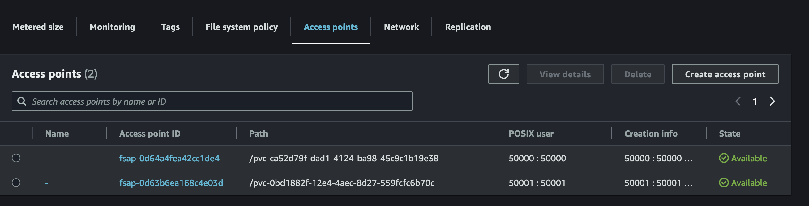

# Create SC

```
# Update FileSystem ID
Edit manifests/01-efs-pv.yaml line 10

  fileSystemId: fs-0f5eecb0ee13c850b


# Verify
kubectl get sc
// There is no efs-sc

# Command
kubectl apply -f manifests/01-efs-sc.yaml
// storageclass.storage.k8s.io/efs-sc created

NAME            PROVISIONER             RECLAIMPOLICY   VOLUMEBINDINGMODE      ALLOWVOLUMEEXPANSION   AGE
efs-sc          efs.csi.aws.com         Delete          Immediate              false                  58s

```

# Deploy App1

```
# Check
kubectl get pods

# Deploy App1
kubectl apply -f manifests/app1.yaml
// Output
persistentvolumeclaim/efs-claim-1 created
pod/efs-app-1 created

# Verify pvc
kubectl get pvc
// Access point: pvc-ca52d79f-dad1-4124-ba98-45c9c1b19e38

NAME          STATUS   VOLUME                                     CAPACITY   ACCESS MODES   STORAGECLASS   VOLUMEATTRIBUTESCLASS   AGE
efs-claim-1   Bound    pvc-ca52d79f-dad1-4124-ba98-45c9c1b19e38   5Gi        RWX            efs-sc         <unset>                 2m19s

# Verify PV
NAME                                       CAPACITY   ACCESS MODES   RECLAIM POLICY   STATUS   CLAIM                 STORAGECLASS   VOLUMEATTRIBUTESCLASS   REASON   AGE
pvc-ca52d79f-dad1-4124-ba98-45c9c1b19e38   5Gi        RWX            Delete           Bound    default/efs-claim-1   efs-sc         <unset>                          5m1s

# Verify AWS Console EFS - Access Point
```

# Deploy App2

```
# Command
kubectl apply -f manifests/app2.yaml
// Output
persistentvolumeclaim/efs-claim-2 created
pod/efs-app-2 created

# PVC
kubectl get pvc
//Output
NAME          STATUS   VOLUME                                     CAPACITY   ACCESS MODES   STORAGECLASS   VOLUMEATTRIBUTESCLASS   AGE
efs-claim-1   Bound    pvc-ca52d79f-dad1-4124-ba98-45c9c1b19e38   5Gi        RWX            efs-sc         <unset>                 7m3s
efs-claim-2   Bound    pvc-0bd1882f-12e4-4aec-8d27-559fcfc6b70c   1Gi        RWX            efs-sc         <unset>                 27s

# PV
kubectl get pv
// Output

NAME                                       CAPACITY   ACCESS MODES   RECLAIM POLICY   STATUS   CLAIM                 STORAGECLASS   VOLUMEATTRIBUTESCLASS   REASON   AGE
pvc-0bd1882f-12e4-4aec-8d27-559fcfc6b70c   1Gi        RWX            Delete           Bound    default/efs-claim-2   efs-sc         <unset>                          54s
pvc-ca52d79f-dad1-4124-ba98-45c9c1b19e38   5Gi        RWX            Delete           Bound    default/efs-claim-1   efs-sc         <unset>                          7m29s
```

✅ EFS Access Points



# Deploy App3

```
# Command
kubectl apply -f manifests/app3.yaml
// Output
pod/efs-app-3 created

# PVC
kubectl get pvc
// Output
NAME          STATUS   VOLUME                                     CAPACITY   ACCESS MODES   STORAGECLASS   VOLUMEATTRIBUTESCLASS   AGE
efs-claim-1   Bound    pvc-ca52d79f-dad1-4124-ba98-45c9c1b19e38   5Gi        RWX            efs-sc         <unset>                 11m
efs-claim-2   Bound    pvc-0bd1882f-12e4-4aec-8d27-559fcfc6b70c   1Gi        RWX            efs-sc         <unset>                 4m41s

# PV
kubectl get pv

# Pods
kubectl get pods
// Output

NAME                            READY   STATUS    RESTARTS      AGE
efs-app-1                       1/1     Running   0             12m
efs-app-2                       1/1     Running   0             6m4s
efs-app-3                       1/1     Running   0             100s
```

✅ App3 will use same pvc with App2. System will not create new Access Point on
EFS

kubectl exec -ti efs-app-1 -- tail -f /app-logs/out.txt

kubectl exec -ti efs-app-2 -- tail -f /app-logs/out.txt

kubectl exec -ti efs-app-3 -- tail -f /app-logs/out.txt

kubectl exec -it efs-app-1 -- sh

kubectl exec -it efs-app-2 -- sh

kubectl exec -it efs-app -- sh
