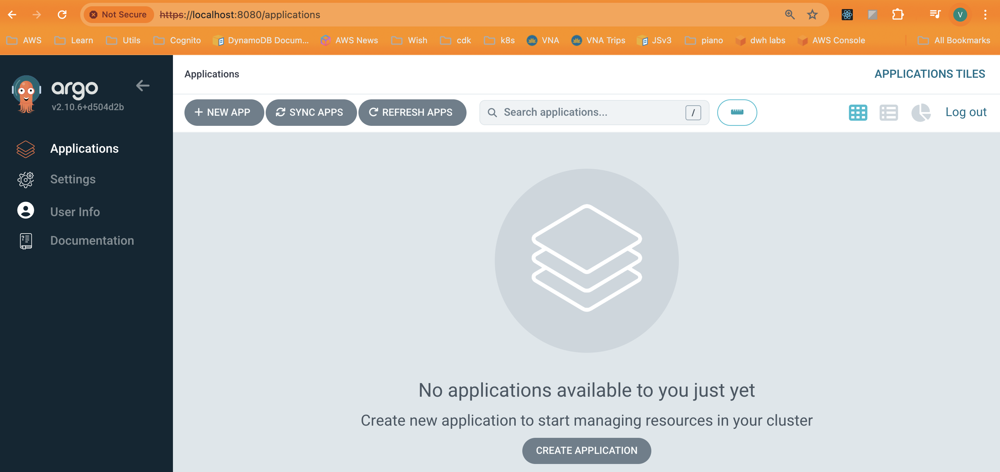

📗 Guide: https://argo-cd.readthedocs.io/en/stable/getting_started/

# 1️⃣ Install ArgoCD

```
kubectl create namespace argocd
kubectl apply -n argocd -f https://raw.githubusercontent.com/argoproj/argo-cd/stable/manifests/install.yaml
```

# 2️⃣ Configure Port Forwarding

```
kubectl port-forward svc/argocd-server -n argocd 8080:443
```

Use your localhost to access: `http://localhost:8080`

# 3️⃣ Get username/password to access ArgoCD

Username: admin

Password:

```
# get secret base64 encoded
kubectl get secrets argocd-initial-admin-secret -n argocd -o yaml

apiVersion: v1
data:
  password: MzRReUo5OXZrQVF0MkJCVw==
kind: Secret
metadata:
  creationTimestamp: "2024-05-01T10:03:34Z"
  name: argocd-initial-admin-secret
  namespace: argocd
  resourceVersion: "2606982"
  uid: f4e20f55-885a-448a-9984-8ccb7d898817
type: Opaque

# password is: MzRReUo5OXZrQVF0MkJCVw==

# decode password
echo 'MzRReUo5OXZrQVF0MkJCVw==' | base64 --decode
# Output: 34QyJ99vkAQt2BBW%

# Password is: 34QyJ99vkAQt2BBW
# Without '%'
```

✅ Login Succeeded!


