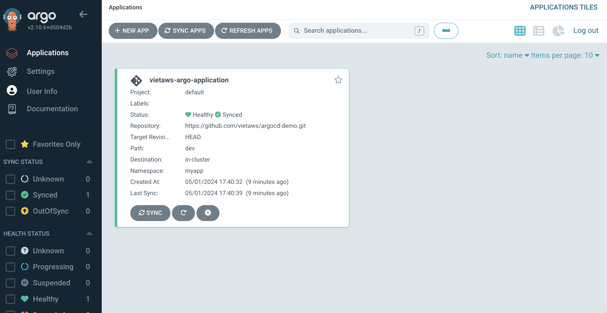
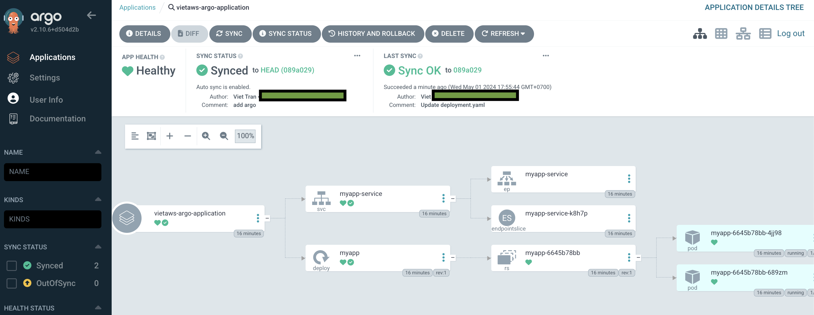

Application repo: https://github.com/vietaws/argocd-demo.git

# 1️⃣ Check your namespace

```
kubectl get namespaces

NAME              STATUS   AGE
argocd            Active   38m
default           Active   12d
kube-node-lease   Active   12d
kube-public       Active   12d
kube-system       Active   12d
```

# 2️⃣ Run application into your cluster

```
# 1 Clone git into your local computer

git clone https://github.com/vietaws/argocd-demo.git

# 2 run apply command to provision into your cluster

kubectl apply -f application.yaml
# Output: application.argoproj.io/vietaws-argo-application created
```

# 3️⃣ Verify

```
# check namespaces
kubectl get ns

NAME              STATUS   AGE
argocd            Active   42m
default           Active   12d
kube-node-lease   Active   12d
kube-public       Active   12d
kube-system       Active   12d
myapp             Active   3m6s

✅ There is myapp namespace

# verify pod
kubectl get pods -n myapp

NAME                    READY   STATUS    RESTARTS   AGE
myapp-6645b78bb-4jj98   1/1     Running   0          4m50s
myapp-6645b78bb-689zm   1/1     Running   0          4m50s

# verify deployment -n myapp
kubectl get deployments

NAME    READY   UP-TO-DATE   AVAILABLE   AGE
myapp   2/2     2            2           5m34s

# verify rs -n myapp
kubectl get rs

NAME              DESIRED   CURRENT   READY   AGE
myapp-6645b78bb   2         2         2       6m1s
```

Check ArgoCD UI: `http://localhost:8080`



Click on the App



✅ You can see the Deployments, RS, and Pod in ArgoCD UI
