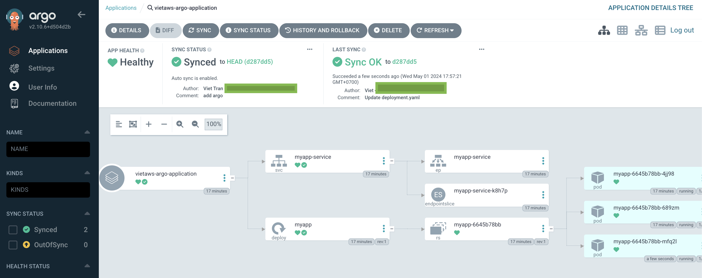

Try to update the replicas from 2 to 3

# 1️⃣ Update Repo

- Goto github repo to update `deployment.yaml` replicas from 2 to 3

‼️ You have to wait for 3 minutes

# 2️⃣ Verify EKS cluster

```
# deployment
kubectl get deployments -n myapp

NAME    READY   UP-TO-DATE   AVAILABLE   AGE
myapp   3/3     3            3           14m
```

Check on ArgoCD UI: `http://localhost:8080`


